# Selenium


## Automation Testing Process
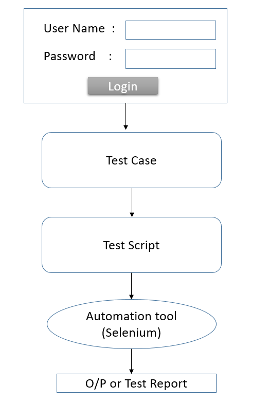

### Introduction to Selenium Automation Tool

* Selenium automation tool is used to automate only web applications.

* Selenium automation tool is open source and freely downloadable.

* It supports all the operating systems like Windows, Linux, Mac OS, Unix etc.

* Selenium supports all browsers like Chrome, Safari, Firefox, Opera etc. 

* Selenium supports different packages, classes and methods to perform automation testing.

* Only object-oriented programming languages are used to convert the test case into test script in automation testing.

* Selenium can automate only web-based applications where as QTP (Quick Test Professional) can automate both desktop and web-based applications.

### Selenium Components / Selenium Suite

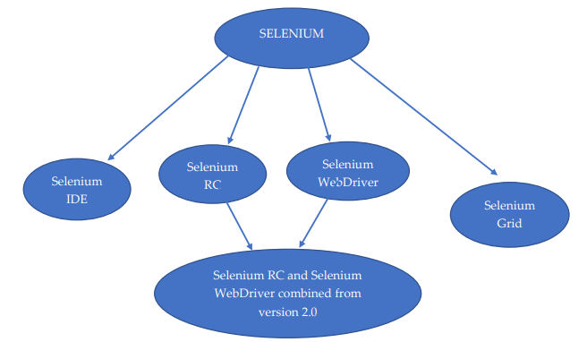

### Selenium IDE

* Selenium IDE stands for Integrated Development Environment.

* It is used to perform “Basic Testing”.

* Selenium IDE is a “Record and Playback” tool.

* In this tool we need not write the test script.

* Selenium IDE is added to the browser as extension.

#### Steps to Add Selenium IDE to web Browser

{{1-5}}
> **Step-1** : Open google chrome and Click on customize and control google chrome button on the top right corner.
>


{{2-5}}
>**Step-2** :Click on Extension and Click on visit chrome web store.
>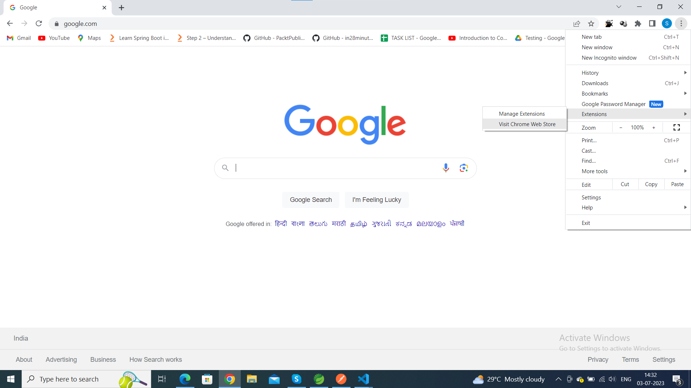

{{3-5}}
>**Step-3** :In search bar, search for Selenium IDE and click on enter.
>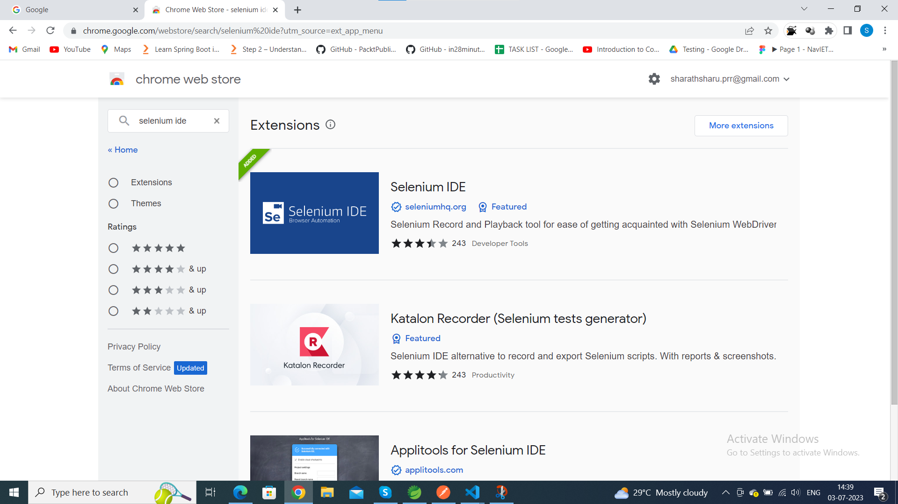

{{4-5}}
>**Step-4** :Select Selenium IDE extension and After downloading u will get a pop-up window
>>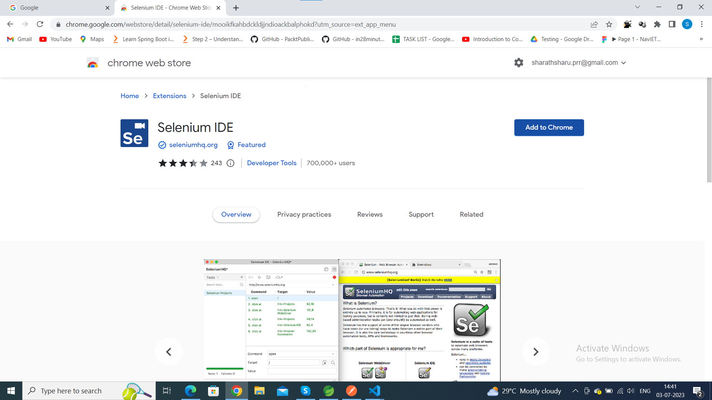

#### Steps to Perform Automation Testing in Selenium IDE

1. Click on extensions button.

2. Click on Selenium IDE.

3. Create a new project and provide a project name.

4. Copy the URL of the web page which is needed to be tested from chrome browser and paste it in Selenium IDE on playback base URL.

5. Start recording and perform the testing steps.

6. Come back to Selenium IDE and stop the recording.

7. Provide test case name and click on enter.

8. Adjust the execution speed, if necessary, by clicking on the clock button.

9. Click on run current test button.

10. Report will be successfully generated by Selenium IDE.

Link to perform selenium IDE : (https://www.youtube.com/watch?v=4I7xay_NV8A)

## Selenium WebDriver

Selenium WebDriver acts as an interface between the test script and the 
browser for performing automation testing.

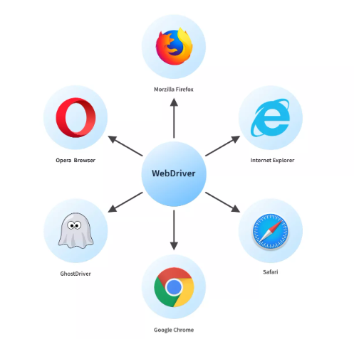

### Steps to Perform automation testing in Selenium Web Driver using Eclipse IDE

* Create a new project in Eclipse IDE.

* Right click on the project and click on build path.

* Now click on configure build path.

* Select libraries and click on add external jars.

* Now select the latest downloaded version of selenium.

* Click on apply and close. 

* Create a class and write the test script to perform automation testing using Selenium WebDriver

#### Scripts

**Scenario**: write a test script to launch the browser (chrome browser), maximize the window and navigate to amazon web page.

**Code**:

```java

package Scripts;

import org.openqa.selenium.chrome.ChromeDriver;

public class TestScript1 {

	public static void main(String[] args) {
		ChromeDriver driver = new ChromeDriver();
		//maximizing the window
		driver.manage().window().maximize();
		//Navigating to amazon web page
		driver.get("https://www.amazon.com/");
	}

}

```
##### Scripts 2

**Scenario**: Write a script to launch the browser, maximize the window, navigate to Flipkart page and get the title of the page, minimize the window, make the window full screen, get the current URL for the web page and close the window

**Code**:

```java
package Scripts;

import org.openqa.selenium.chrome.ChromeDriver;

public class TestScript2 {

	public static void main(String[] args) {
		// TODO Auto-generated method stub

		//launching the browser
		ChromeDriver driver = new ChromeDriver();
		//maximizing the window
		driver.manage().window().maximize();
		//Navigating to flipkart web page
		driver.get("https://www.flipkart.com/");
		//getting the title of flipkart page
		String title=driver.getTitle();
		System.out.println("Title of flipkart page is:"+title);
		//minimizing the window
		driver.manage().window().minimize();
		//full screen the window
		driver.manage().window().fullscreen();
		//Current Url of web page
		System.out.println("the current url is:"+driver.getCurrentUrl());
		//close the window
		driver.close();
		
		
	}

}

```

**Output**: 

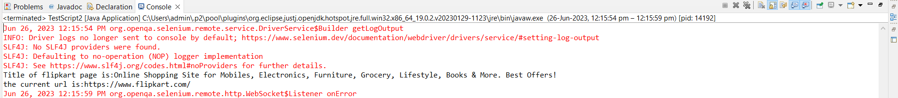


##### Scripts 3

**Scenario**: Write a script to launch the browser, maximize the window, navigate to Google page, get the actual title of the page and compare if the actual page is matching with the expected title, if the title is matching then print “Title is matching” if not print “Title is not matching”

**Code**:

```java
package Scripts;

import org.openqa.selenium.chrome.ChromeDriver;

public class TestScript3 {

	public static void main(String[] args) {
			//launching the browser
			ChromeDriver driver = new ChromeDriver();
			//maximizing the window
			driver.manage().window().maximize();
			//Navigating to google web page
			driver.get("https://www.google.com/");
			//getting the actual title of google page
			String ActualTitle=driver.getTitle();
			System.out.println("Title of google page is "+ ActualTitle);
			String ExpectedTitle="Google";
			//comparing actual title with expected title
			if(ActualTitle.equals(ExpectedTitle))
			{
			System.out.println("Title is matching");
			}
			else
			{
			System.out.println("Title is not matching");
			}
			
			
	}

}

```


**Output**: 

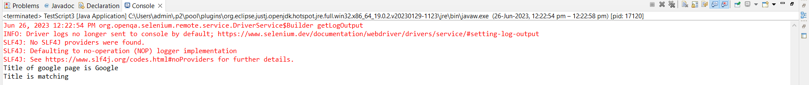

## LOCATORS

* A web page is a collection of different web elements like hyperlink/hypertext, radio button, search box, drop down box, text box, I-frame etc.
* Selenium provides different locators to identify different web elements present in the web page, those are

1. Id locator

2. Name locator

3. Class name locator

4. Tag name locator 

5. Link text locator 

6. Partial link text locator 

7. X-path locator 

8. CSS selector locator.

### Scripts

**Scenario**:  write a test script to launch the browser (chrome browser), maximize the window, navigate to google page and click on Gmail link.

**Code** :

```java

import org.openqa.selenium.By;
import org.openqa.selenium.WebElement;
import org.openqa.selenium.chrome.ChromeDriver;
public class TestScript1
{
public static void main (String [] args)
{
//launching the browser
ChromeDriver driver = new ChromeDriver();
//maximize the window
driver.manage().window().maximize();
//navigating to google page
driver.get("https://www.google.com/");
//locating gmail hyperlink/hypertext
WebElement link = driver.findElement(By.linkText("Gmail"));
//clicking on hyperlink
link.click();
}
}

```


### Scripts 2

**Scenario**: Write a script to launch the browser, maximize the window, navigate to Facebook page, click on “Contact uploading and non-users “hyper link and get the count of all the hyperlinks

**Code** :

```java
package Locators;


import java.util.Iterator;
import java.util.List;
import org.openqa.selenium.By;
import org.openqa.selenium.WebElement;
import org.openqa.selenium.chrome.ChromeDriver;

public class TestScript2 {

	public static void main(String[] args) {
		// TODO Auto-generated method stub
		//launching the browser
		ChromeDriver driver = new ChromeDriver();
		//maximize the window
		driver.manage().window().maximize();
		//navigating to facebook page
		driver.get("https://www.facebook.com/");
		//locating contact uploading and non-users using partialLinkText locator
		WebElement link =driver.findElement(By.partialLinkText("uploading"));
		//locating contact uploading and non-users using LinkText locator
		WebElement links = driver.findElement(By.linkText("Contact uploading and non-users"));
		//to fetch all the hyper links
		List<WebElement> list_links= driver.findElements(By.tagName("a"));
		//display the count of all the hyperlinks in list
		System.out.println(list_links.size());
		//clicking on hyperlink
		link.click();

	}

}
```
**Output**:
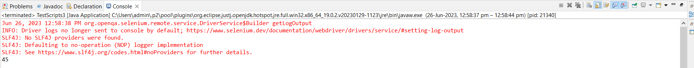


### Scripts 3

**Scenario**:Write a script to launch the browser, maximize the window, navigate to Facebook page, click on “Contact uploading and non-users “hyper link, get the count of all the hyperlinks and display all the elements(hyperlinks) in the console


**Code** :

```java

package Locators;

import java.util.List;
import org.openqa.selenium.By;
import org.openqa.selenium.WebElement;
import org.openqa.selenium.chrome.ChromeDriver;

public class TestScripts3 {

	public static void main(String[] args) {
		// TODO Auto-generated method stub

		//launching the browser
		ChromeDriver driver = new ChromeDriver();
		//maximize the window 
		driver.manage().window().maximize();
		//navigating to facebook page
		driver.get("https://www.facebook.com/");
		 //locating contact uploading and non-users using partialLinkText locator
		WebElement link = driver.findElement(By.partialLinkText ("uploading"));
		//locating contact uploading and non-users using linkText locator
		//WebElement links = driver.findElement(By.linkText("Contact uploading and non-users"));
		//to fetch all the hyper links
		List<WebElement> list_links= driver.findElements(By.tagName("a"));
		//display the count of all the hyperlinks in list
		System.out.println(list_links.size());
		//Traversing through the list by using traditional for loop and getting the elements on the console
		/* for (int i=0; i<list_links.size();i++) {
		System.out.println(list_links.get(i).getText()); } */
		//Traversing through the list by using for each loop/advanced for loop/enhanced for loop and getting the elements on the console
		for (WebElement e: list_links) {
		System.out.println(e.getText());
		}
		//clicking on hyperlink
		link.click();

	}

}
```
**Output**: 

```
Jun 26, 2023 12:58:38 PM org.openqa.selenium.remote.service.DriverService$Builder getLogOutput
INFO: Driver logs no longer sent to console by default; https://www.selenium.dev/documentation/webdriver/drivers/service/#setting-log-output
SLF4J: No SLF4J providers were found.
SLF4J: Defaulting to no-operation (NOP) logger implementation
SLF4J: See https://www.slf4j.org/codes.html#noProviders for further details.
45

Forgotten password?
Create new account
Create a Page
?????
????
?????
??????
??????
?????
??????
?????
???????
??????

Sign Up
Log in
Messenger
Facebook Lite
Watch
Places
Games
Marketplace
Meta Pay
Meta Store
Meta Quest
Instagram
Fundraisers
Services
Voting Information Centre
Privacy Policy
Privacy Centre
Groups
About
Create ad
Create Page
Developers
Careers
Cookies
AdChoices
Terms
Help
Contact uploading and non-users
Settings
Activity log

```

### Scripts 4

**Scenario**: write a test script to launch the browser (chrome browser), maximize the window, navigate to google page and type git.com in the search bar.

**Code** :

```java

package Locators;

import org.openqa.selenium.By;
import org.openqa.selenium.WebElement;
import org.openqa.selenium.chrome.ChromeDriver;

public class TestScripts4 {

	public static void main(String[] args) {
		// TODO Auto-generated method stub
		//launching the browser
		ChromeDriver driver = new ChromeDriver();
		//maximize the window
		driver.manage().window().maximize();
		//navigating to google page
		driver.get("https://www.google.com/");
		//locating search bar web element
		WebElement search = driver.findElement(By.name("q"));
        //	Or 
		//WebElement search = driver.findElement(By.className("gLFyf"));
		//to send the keys
		search.sendKeys("git.com");
	}

}

```

### Scripts 5

**Scenario**: write a script to launch the browser, maximize the window, navigate to Facebook page, locate the email box and send your email, locate the passwordbox and send the password.

**Code**

```java

package Locators;

import org.openqa.selenium.By;
import org.openqa.selenium.WebElement;
import org.openqa.selenium.chrome.ChromeDriver;

public class TestScript5 {

	public static void main(String[] args) {
		//launching the browser
		ChromeDriver driver = new ChromeDriver();
		//maximize the window
		driver.manage().window().maximize();
		//navigating to facebook page
		driver.get("https://www.facebook.com/");
		//locating the email box
		WebElement email = driver.findElement(By.name("email"));
		//locating the password box
		WebElement password = driver.findElement(By.name("pass"));
		//sending the keys to email box
		email.sendKeys("selenium@gmail.com");
		//sending the keys to password box
		password.sendKeys("automation");

	}

}
```


### Scripts 6

**Scenario**:Write a script to launch the browser, maximize the window, navigate to Facebook page, locate the create new hyperlink and after clicking locate first name, surname, mobile number, password and send the corresponding values to the web elements. Using all the three different methods (selectByIndex(), selectByValue(), selectByVisibleText()) send the corresponding values by locating the drop down box in Facebook page.

* Note: To automate the drop-down box or select box selenium provides Select Class. We have to create the object of Select class by passing the web element as an argument to the select class constructor.

* Inside Select class there are 3 different methods to select the options present in the select box, they are 

1. selectByIndex()
2. selectByValue()
3. selectByVisibleText()


**Code**:

```java
package Locators;
import java.util.List;
import org.openqa.selenium.By;
import org.openqa.selenium.WebElement;
import org.openqa.selenium.chrome.ChromeDriver;
import org.openqa.selenium.support.ui.Select;

public class TestScripts6 {

	public static void main(String[] args) throws InterruptedException {
		// TODO Auto-generated method stub
		// launching the browser
		ChromeDriver driver = new ChromeDriver();
		// maximize the window
		driver.manage().window().maximize();
		// navigating to Facebook page
		driver.get("https://www.facebook.com/");
		// locating the Create new account hyperlink
		WebElement link =driver.findElement(By.partialLinkText("Create new account"));
		// clicking the Create new account hyperlink
		link.click();
	
		Thread.sleep(3000);
		/* we use thread.sleep, because the execution speed of eclipse is 
		not matching with web page loading speed and we get 'no such element exception' */
		// locating the first name web element
		WebElement firstname = driver.findElement(By.name("firstname"));
		// sending values to first name web element
		firstname.sendKeys("lokesh");
		// locating the last name web element
		WebElement lastname = driver.findElement(By.name("lastname"));
		// sending values to last name web element
		lastname.sendKeys("kumar");
		// locating the mobile number web element
		WebElement mobilenumber = driver.findElement(By.name("reg_email__"));
		// sending values to mobile number web element
		mobilenumber.sendKeys("7899586482");
		// locating the password web element
		WebElement password = driver.findElement(By.name("reg_passwd__"));
		// sending values to password web element
		password.sendKeys("Autom@tion");
		//locating the drop-down box and sending the corresponding values
		// using selectByIndex() method
		 WebElement day= driver.findElement(By.name("birthday_day"));
		Select sel1 = new Select(day);
		 sel1.selectByIndex(22);
		WebElement month= driver.findElement(By.name("birthday_month"));
		Select sel2 = new Select(month);
		sel2.selectByIndex(2);
		WebElement year= driver.findElement(By.name("birthday_year"));
		 Select sel3 =new Select(year);
		sel3.selectByIndex(25);

    }
}
```

## MOUSE ACTIONS

1. Drag and Drop

2. Right click/context click

3. Scroll 

4. Double click

5. Hover action

### Scripts


**Scenario**:  Write a script to launch the browser, maximize the window, navigate to jquery ui page, and perform DRAG and DROP action

**Code**:

```java
package MouseActions;
import org.openqa.selenium.By;
import org.openqa.selenium.WebElement;
import org.openqa.selenium.chrome.ChromeDriver;
import org.openqa.selenium.interactions.Actions;

public class TestScript1 {

	public static void main(String[] args) {

		// launching the browser
		ChromeDriver driver = new ChromeDriver();
		// maximize the window
		driver.manage().window().maximize();
		// navigating to jquery web page
		driver.get("https://jqueryui.com/droppable/");
		//locating the iframe
		WebElement iframe = driver.findElement(By.className("demo-frame"));
		//switch to iframe box
		driver.switchTo().frame(iframe);
		//locating drag box
		WebElement dragbox = driver.findElement(By.id("draggable"));
		//locating drop box
		WebElement dropbox = driver.findElement(By.id("droppable"));
		Actions act = new Actions(driver);
		//perform drag and drop
		act.dragAndDrop(dragbox, dropbox).build().perform();


	}

}
```

#### Scripts 2


**Scenario**: Write a script to launch the browser, maximize the window, navigate to jquery ui page, perform click and hold action, moveToElement action and release action

**Code**:

```java
package MouseActions;
import org.openqa.selenium.By;
import org.openqa.selenium.WebElement;
import org.openqa.selenium.chrome.ChromeDriver;
import org.openqa.selenium.interactions.Actions;

public class TestScript2 {

	public static void main(String[] args) {
		// TODO Auto-generated method stub

		// launching the browser
		ChromeDriver driver = new ChromeDriver();
		// maximize the window
		driver.manage().window().maximize();
		// navigating to jquery web page
		driver.get("https://jqueryui.com/droppable/");
		//locating the iframe
		WebElement iframe = driver.findElement(By.className("demo-frame"));
		//switch to iframe box
		driver.switchTo().frame(iframe);
		//locating drag box
		WebElement dragbox = driver.findElement(By.id("draggable"));
		//locating drop box
		WebElement dropbox = driver.findElement(By.id("droppable"));
		Actions act = new Actions(driver);
		//perform click and hold, moveToElement , release action.
		act.clickAndHold(dragbox).moveToElement(dropbox).release().build().perform();

	}

}
```


#### Scripts 3


**Scenario**: write a test script to launch the chrome browser, maximize the window, navigate to google page perform HOVER EFFECT on Gmail

**Code**:

```java
package MouseActions;

import org.openqa.selenium.By;
import org.openqa.selenium.WebElement;
import org.openqa.selenium.chrome.ChromeDriver;
import org.openqa.selenium.interactions.Actions;

public class TestScript3 {

	public static void main(String[] args) {
		// TODO Auto-generated method stub
		// launching the browser
		ChromeDriver driver = new ChromeDriver();
		// maximize the window
		driver.manage().window().maximize();
		// navigating to google web page
		driver.get("https://google.com/");
		//locating Gmail hyperlink/hypertext
		WebElement gmail = driver.findElement(By.linkText("Gmail"));
		//creating the object for Actions class
		Actions act = new Actions(driver);
		//performing hover effect
		act.moveToElement(gmail).build().perform();

	}

}
```

#### Scripts 4


**Scenario**: write a test script to launch the chrome browser, maximize the window, navigate to google page and type amazon.com in the search bar where amazon must be in upper case and .com must be in lower case.


**Code**:

```java
package MouseActions;
import org.openqa.selenium.By;
import org.openqa.selenium.Keys;
import org.openqa.selenium.WebElement;
import org.openqa.selenium.chrome.ChromeDriver;
import org.openqa.selenium.interactions.Actions;

public class TestScript4 {

	public static void main(String[] args) {
		// TODO Auto-generated method stub
		// launching the browser
		ChromeDriver driver = new ChromeDriver();
		// maximize the window
		driver.manage().window().maximize();
		// navigating to google web page
		driver.get("https://google.com/");
		// locating the search box
		WebElement search = driver.findElement(By.name("q"));
		//creating the object of Actions class
		Actions act = new Actions(driver);
		//to type amazon in upper case
		act.keyDown(Keys.SHIFT).build().perform();
		search.sendKeys("amazon");
		//to type .com in lower case
		act.keyUp(Keys.SHIFT).build().perform();
		search.sendKeys(".com");
		//act.keyDown(Keys.SHIFT).sendKeys("amazon").keyUp(Keys.SHIFT).sendKeys(".com").build().perform();

	}

}
```

## NAVIGATE APIs

1. navigate().back();

2. navigate().forward();

3. navigate().refresh();

4. navigate().to()


### Scripts 


**Scenario**: write a test script to launch the chrome browser, maximize the window, navigate to Zomato page and automate Navigation APIs

**Code**:

```java
package Navigate;

import org.openqa.selenium.By;
import org.openqa.selenium.WebElement;
import org.openqa.selenium.chrome.ChromeDriver;


public class TestScript1 {

	public static void main(String[] args) {
		// TODO Auto-generated method stub

		// launching the browser
		ChromeDriver driver = new ChromeDriver();
		// maximize the window
		driver.manage().window().maximize();
		// navigating to zomato web page using navigate().to() method
		driver.navigate().to("https://zomato.com/");
		///locate add restaurant
		WebElement restaurant = driver.findElement(By.partialLinkText("Add restaurant"));
		//click on add restaurant
		restaurant.click();
		//navigate back
		driver.navigate().back();
		
		try {
			Thread.sleep(2000);
		} catch (InterruptedException e) {
			// TODO Auto-generated catch block
			e.printStackTrace();
		}
        //navigate forward
		driver.navigate().forward();
		//navigate refresh
		driver.navigate().refresh();

	}

}
```

## WINDOW HANDLING IN SELENIUM

Window handling in selenium can be done by using two methods.

1. getWindowHandle( ): This method will return the address of the web page where selenium is present.

2. getWindowHandles( ): This method will return the address of both parent and child windows.


### Scripts 


**Scenario**: write a test script to launch the chrome browser, maximize the window, navigate to parent window, get the address of the parent window using getWindowHandle( ) method ,locate the hyper link present in the parent window, after clicking on the hyperlink, get the address of the child window using getWindowHandle( ) method and check if both the addresses are same or different if same then selenium is present in parent window.

**HTML Code**:

```html
<!DOCTYPE html>
<html>
<head><title>My Window</title></head>
<body>
<h1>Parent Window </h1>
<a href="https://www.fb.com" target="_blank">click here</a>
</body> </html>

```

**Code** :

```Java
package WindowsHandling;
import org.openqa.selenium.By;
import org.openqa.selenium.WebElement;
import org.openqa.selenium.chrome.ChromeDriver;

public class TestScript1 {

	public static void main(String[] args) {
		// TODO Auto-generated method stub
		ChromeDriver driver = new ChromeDriver();
		// maximize the window
		driver.manage().window().maximize();
		// navigating to my window web page
		driver.navigate().to("E:\\Automation\\Selenium\\HTML\\Index.html");
		//file:///E:/Automation/Selenium/HTML/Index.html
		//locating the hyper link
		WebElement link = driver.findElement(By.linkText("click here"));
		//clicking the link
		link.click();
		//locate the address of parent window
		String parent_window = driver.getWindowHandle();
		System.out.println("currently selenium is present in "+parent_window);
		//locate the address of child window
		String child_window = driver.getWindowHandle();
		System.out.println("currently selenium is present in "+child_window);

	}

}

```

**Output**:

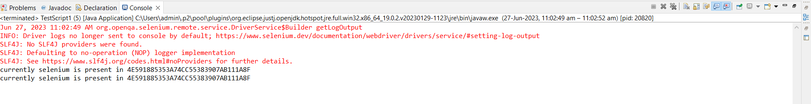


#### Scripts 2 


**Scenario**: write a test script to launch the chrome browser, maximize the window, navigate to parent window, get the address of both the parent window and child window using getWindowHandles( ) method.

**HTML Code**:

```html
<!DOCTYPE html>
<html>
<head><title>My Window</title></head>
<body>
<h1>Parent Window </h1>
<a href="https://www.fb.com" target="_blank">click here</a>
</body> </html>

```

**Code** :

```Java
package WindowsHandling;
import java.util.Set;
import org.openqa.selenium.By;
import org.openqa.selenium.WebElement;
import org.openqa.selenium.chrome.ChromeDriver;

public class TestScript2 {

	public static void main(String[] args) {
		// TODO Auto-generated method stub
		// launching the browser
		ChromeDriver driver = new ChromeDriver();
		// maximize the window
		driver.manage().window().maximize();
		// navigating to my window web page
		driver.navigate().to("E:\\Automation\\Selenium\\HTML\\Index.html");
		//locating the hyper link
		WebElement link = driver.findElement(By.linkText("click here"));
		//clicking the link
		link.click();
		//locate the address of parent window
		String parent_window = driver.getWindowHandle();
		System.out.println("currently selenium is present in "+parent_window);
		//locating the address of child window
		String child_window = driver.getWindowHandle();
		System.out.println("currently selenium is present in "+child_window);
		//locating the addresses of both child and parent window
		Set<String> address = driver.getWindowHandles();
		System.out.println("address of both parent and child windows"+address);
		for (String i: address)
		{
		System.out.println(i); 
		}
	}

}
```

**Output**:

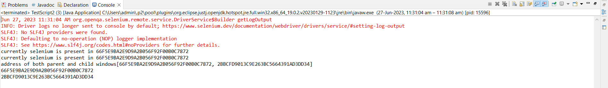


#### Scripts 2 


**Scenario**:write a test script to launch the chrome browser, maximize the window, navigate to parent window, get the address of the parent window, locate the hyper link present in the parent window, after clicking on the hyperlink, get the address of the child window, switch to child window and send the keys to all the web elements and then switch back to parent window by passing the parent web page address.

**HTML Code**:

```html
<!DOCTYPE html>
<html>
<head><title>My Window</title></head>
<body>
<h1>Parent Window </h1>
<a href="https://www.fb.com" target="_blank">click here</a>
</body> </html>

```

**Code** :

```Java
package WindowsHandling;
import java.util.List;
import java.util.Set;
import org.openqa.selenium.By;
import org.openqa.selenium.WebElement;
import org.openqa.selenium.chrome.ChromeDriver;
import org.openqa.selenium.support.ui.Select;

public class TestScript3 {

	public static void main(String[] args) {
		// TODO Auto-generated method stub
		// launching the browser
		ChromeDriver driver = new ChromeDriver();
		// maximize the window
		driver.manage().window().maximize();
		// navigating to my window web page
		driver.navigate().to("E:\\Automation\\Selenium\\HTML\\Index.html");
		//locating the hyper link
		WebElement link = driver.findElement(By.linkText("click here"));
		//clicking the link
		link.click();
		//locate the address of parent window
		String parent_window = driver.getWindowHandle();
		System.out.println("currently selenium is present in "+parent_window);
		//locating the address of both parent and child window
		Set<String> address = driver.getWindowHandles();
		System.out.println("address of both parent and child windows"+address);
		for (String i : address) {
		if(i.equals(parent_window)) {
			
		
		//do nothing!
			}
		else {
		driver.switchTo().window(i); 
		// locating the Create new account hyperlink
		WebElement links= driver.findElement(By.partialLinkText("Create new account"));
		// clicking the Create new account hyperlink
		links.click();
		try {
			Thread.sleep(3000);
		} catch (InterruptedException e) {
			// TODO Auto-generated catch block
			e.printStackTrace();
		} // we use thread.sleep, because the execution speed of eclipse is not matching with web page loading speed and we get 'no such element exception'
		// locating the first name web element
		WebElement firstname = driver.findElement(By.name("firstname"));
		// sending values to first name web element
		firstname.sendKeys("Lokesh");
		// locating the last name web element
		WebElement lastname = driver.findElement(By.name("lastname"));
		// sending values to last name web element
		lastname.sendKeys("Kumar");
		// locating the mobile number web element
		WebElement mobilenumber = driver.findElement(By.name("reg_email__"));
		// sending values to mobile number web element
		mobilenumber.sendKeys("7489561235");
		// locating the password web element
		WebElement password = driver.findElement(By.name("reg_passwd__"));
		// sending values to password web element
		password.sendKeys("Autom@tion");
		// sending the values to drop down box using selectByVisibleText() method
		//sending values to day
		WebElement day= driver.findElement(By.name("birthday_day"));
		Select sel1 =new Select(day);
		sel1.selectByVisibleText("05");
		//sending values to month
		WebElement month= driver.findElement(By.name("birthday_month"));
		Select sel2 = new Select(month);
		sel2.selectByVisibleText("Nov");
		//sending values to year
		WebElement year= driver.findElement(By.name("birthday_year"));
		Select sel3 = new Select(year);
		sel3.selectByVisibleText("1997"); }
		
		try {
			Thread.sleep(3000);
		} catch (InterruptedException e) {
			// TODO Auto-generated catch block
			e.printStackTrace();
		}
		driver.switchTo().window(parent_window);
		}
		}

}
```

##  CSS SELECTORS 

1. Tagname and Id_value

2. Tagname and class_value

3. Tagname and any attribute 

4. Tagname class_value and any attribute

5. Tagname id_value and any attribute

6. Substring 

* Startswith: ^

* Endswith: $

* Contains: *

### Tagname and Id_value:
* Syntax: tagname#Id_value
* Tagname is the name of the tag.
*  Id_value is the value which is present in id attribute.
*  "#" symbol is the representation of id attribute.
### Tagname and class_value:
* Syntax: tagname.class_value
* Tagname is the name of the tag.
* class_value is the value which is present in class attribute.
* . symbol is the representation of class attribute.
### Tagname and any attribute:
* Syntax: tagname[attribute_name=’attribute_value’]
* Tagname is the name of the tag.
* attribute_name is the name of the any attribute of the element.
* Attribute_value is the value of selected attribute_name.
### Tagname, class_value and any attribute:
* Syntax: tagname.class_value[attribute_name=’attribute_value’]
* Tagname is the name of the tag.
* . symbol is the representation of class attribute.
* class_value is the value which is present in class attribute.
* attribute_name is the name of the any attribute of the element.
### Tagname, Id_value and any attribute:
* Syntax: tagname#Id_value[attribute_name=’attribute_value’]
* Tagname is the name of the tag.
* "#" symbol is the representation of id attribute.
* Id_value is the value which is present in id attribute.
* attribute_name is the name of the any attribute of the element.
* Attribute_value is the value of selected attribute_name.

### Using substring approach

1. Startswith: ^

* Syntax: tagname[attribute_name^=’attribute_value’]

* ^ symbol is used to represent that attribute value starts with a particular word.

* attribute_name is the name of the any attribute of the element.

* Attribute_value is the value of selected attribute_name.

2. Endswith: $

* Syntax: tagname[attribute_name$=’attribute_value’]

* $ symbol is used to represent that attribute value ends with a particular word.

* attribute_name is the name of the any attribute of the element.

*  Attribute_value is the value of selected attribute_name.

3. Contains: *

* Syntax: tagname[attribute_name*=’attribute_value’]

* * Symbol is used to represent that attribute value contains a particular word.

* attribute_name is the name of the any attribute of the element.

* Attribute_value is the value of selected attribute_name.


#### Scripts 


**Scenario**:Write a script to launch the browser, maximize the window, navigate to Facebook page, locate the create new hyperlink, after clicking, locate the password element using css selector and send keys to password field.

**Code**:

```java
package CssSelector;
import org.openqa.selenium.By;
import org.openqa.selenium.WebElement;
import org.openqa.selenium.chrome.ChromeDriver;

public class TestScript1 {

	public static void main(String[] args) {
		// TODO Auto-generated method stub

		// launching the browser
		ChromeDriver driver = new ChromeDriver();
		// maximize the window
		driver.manage().window().maximize();
		// navigating to Facebook page
		driver.get("https://www.facebook.com/");
		// locating the Create new account hyperlink
		WebElement link = driver.findElement(By.partialLinkText("Create new account"));
		// clicking the Create new account hyperlink
		link.click();
		try {
			Thread.sleep(3000);
		} catch (InterruptedException e) {
			// TODO Auto-generated catch block
			e.printStackTrace();
		}
		//locating password filed by using css selector- tagname & id_value
		WebElement password = driver.findElement(By.cssSelector("input#password_step_input"));
		//sending the keys to password
		password.sendKeys("Autom@tion");

	}

}
```


##### Scripts 2


**Scenario**:Write a script to launch the browser, maximize the window, navigate to Facebook page, locate the create new hyperlink, after clicking, locate the male radio button using css selector and click on it


**Code**:

```java

package CssSelector;
import org.openqa.selenium.By;
import org.openqa.selenium.WebElement;
import org.openqa.selenium.chrome.ChromeDriver;

public class TestScript2 {

	public static void main(String[] args) {
		// TODO Auto-generated method stub
		// launching the browser
		ChromeDriver driver = new ChromeDriver();
		// maximize the window
		driver.manage().window().maximize();
		// navigating to Facebook page
		driver.get("https://www.facebook.com/");
		// locating the Create new account hyperlink
		WebElement link = driver.findElement(By.partialLinkText("Create new account"));
		// clicking the Create new account hyperlink
		link.click();
		try {
			Thread.sleep(3000);
		} catch (InterruptedException e) {
			// TODO Auto-generated catch block
			e.printStackTrace();
		}
		//locating password filed by using css selector- tagname and any attribute
		WebElement male = driver.findElement(By.cssSelector("input[value='2']"));
		//clicking on male radio button
		male.click();
		
	}

}
```


##### Scripts 3

**Scenario**: Write a script to launch the browser, maximize the window, navigate to zomato page, locate email web element and send the keys.

**Code**:

```java
package CssSelector;

import org.openqa.selenium.By;
import org.openqa.selenium.WebElement;
import org.openqa.selenium.chrome.ChromeDriver;

public class TestScript3 {

	public static void main(String[] args) {
		// TODO Auto-generated method stub
		// launching the browser
		ChromeDriver driver = new ChromeDriver();
		// maximize the window
		driver.manage().window().maximize();
		// navigating to zomato page
		driver.get("https://www.zomato.com/");
		driver.findElement(By.cssSelector("input.sc-1yzxt5f-9")).sendKeys("selenium@gmail.com");

	}

}
```


##### Scripts 4

**Scenario**:Write a script to launch the browser, maximize the window, navigate to zomato page, locate phone number radio button and send the keys using advanced locators


**Code**:

```java

package CssSelector;
import org.openqa.selenium.By;
import org.openqa.selenium.chrome.ChromeDriver;

public class TestScript4 {

	public static void main(String[] args) {
		// TODO Auto-generated method stub
		// launching the browser
		ChromeDriver driver = new ChromeDriver();
		// maximize the window
		driver.manage().window().maximize();
		// navigating to zomato page
		driver.get("https://www.zomato.com/");
		//locating phone number radio button using css selector- tagname and any attribute
		driver.findElement(By.cssSelector("circle[value='mobile']")).click();
		//locating and sending keys to phone number text box using css selector-taganme ,class_value and any attribute
		driver.findElement(By.cssSelector("input.sc-60vv3c-0[class='sc-60vv3c-0 fyGVHZ scfvLVrH eLNIdd']")).sendKeys("7338439554");
		

	}

}
```

##### Scripts 5

**Scenario**:Write a script to launch the browser, maximize the window, navigate to Facebook page, locate the create new hyperlink, after clicking locate first name, surname, email, password and send the keys.

**Code**:

```java
package CssSelector;

import org.openqa.selenium.By;
import org.openqa.selenium.WebElement;
import org.openqa.selenium.chrome.ChromeDriver;

public class TestScript5 {

	public static void main(String[] args) {
		// TODO Auto-generated method stub
		// launching the browser
		ChromeDriver driver = new ChromeDriver();
		// maximize the window
		driver.manage().window().maximize();
		// navigating to Facebook page
		driver.get("https://www.facebook.com/");
		// locating the Create new account hyperlink
		WebElement link = driver.findElement(By.partialLinkText("Create new account"));
		// clicking the Create new account hyperlink
		link.click();
		try {
			Thread.sleep(3000);
		} catch (InterruptedException e) {
			// TODO Auto-generated catch block
			e.printStackTrace();
		}
		//locating first name using css selector -tagname and any attribute
		driver.findElement(By.cssSelector("input[name='firstname']")).sendKeys("Lokesh");
		//locating surname using css selector- substring contains *
		driver.findElement(By.cssSelector("input[name*='lastname']")).sendKeys("Kumar");
		//locating email using css selector- substring startswith ^
		driver.findElement(By.cssSelector("input[name^='reg_email__']")).sendKeys 
		("selenium190@gmail.com");
		//locating reconfirm email using substring- endswith $
		driver.findElement(By.cssSelector("input[name$='confirmation__']")).sendKeys 
		("selenium190@gmail.com");
		//locating password filed by using css selector-tagname ,id_value and any attribute
		driver.findElement(By.cssSelector("input#password_step_input[name='reg_passwd__']")).sendKeys("12345678");

	}

}

```


##### Scripts 6

**Scenario**: Write a script to launch the browser, maximize the window, navigate to yatra page, locate and click on student fare checkbox, locate and click on hotels,locate and click on holidays using css selectors


**Code**:

```java

package CssSelector;

import org.openqa.selenium.By;
import org.openqa.selenium.WebElement;
import org.openqa.selenium.chrome.ChromeDriver;


public class TestScripts6 {

	public static void main(String[] args) {
		// TODO Auto-generated method stub
		// launching the browser
		ChromeDriver driver = new ChromeDriver();
		// maximize the window
		driver.manage().window().maximize();
		// navigating to yatra page
		driver.get("https://www.yatra.com/");
		//locating and clicking on student fare checkbox by using css selectorstartswith
		driver.findElement(By.cssSelector("a[title^='Student']")).click();
		//locating and clicking on hotel using css selector-endswith
		driver.findElement(By.cssSelector("a[id$='hotels']")).click();
		//locating and clicking on holidays using css selector-contains
		driver.findElement(By.cssSelector("a[id*='holidays']")).click();

	}

}
```
##  X-PATH

Absolute X-path
Relative X-path

| ABSOLUTE X-PATH  |  RELATIVE X-PATH |
|---|---|
| In absolute x-path expression will start from the root element (html tag).  |  In relative x-path expression will start from the parent element. |
| In absolute x-path single forward slash(/) is used.  |In relative x-path double forward slash(//) is used   |
| Absolute x-path expression is larger in size compared to relative x-path expression.  | Relative x-path expression is smaller expression compared to absolute x-path expressions.  |
|Consumes more time in test execution. | Consumes less time in text execution|
|Absolute x-path is used less | Relative x-path is used frequently.|
|Ex: /html/body/div[1]/table/tbody/td[1]/a | Ex://div[1]//table//tbody//tr//td[1]//a |


### DOM Structure

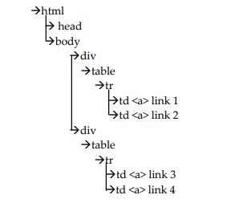


1. Absolute X path: to locate link 1

* /html/body/div[1]/table/tbody/td[1]/a (or)

* /html/body/div[1]/table/tbody/td[1]

2. Relative X path: to locate link 1

* //div[1]//table//tbody//tr//td[1]//a (or)

* //div[1]//td[1]//a (or)

* // div[1]//td[1]


#### Scripts 

**Scenario**: Write a script to launch the browser, maximize the window, navigate to my web page, locate and click on link 1 and link 2 by using absolute and relative x-path.

**HTML Code**

```html
<!DOCTYPE html>
<html>
 <head>
 <title>My Web Page</title>
 </head>
<body>
 <div>
 <table border>
 <tr>
 <td>
 <a href="https://www.fb.com" target="_blank">link1</a> 
 </td>
 <td>
 <a href="https://www.zomato.com" target="_blank">link2</a> 
 </td>
 </tr>
 </table border>
 </div>
 <div>
 <table border>
 <tr>
 <td>
 <a href="https://www.amazon.com" target="_blank">link3</a> 
 </td>
 <td>
 <a href="https://www.hackerrank.com" target="_blank">link4</a> 
 </td> 
 </tr>
 </table border>
 </div>
</body>
</html>

```

**Code**:

```java
package Xpath;

import org.openqa.selenium.By;
import org.openqa.selenium.chrome.ChromeDriver;


public class TestScript1 {

	public static void main(String[] args) {
		// TODO Auto-generated method stub

		
		// launching the browser
		ChromeDriver driver = new ChromeDriver();
		// maximize the window
		driver.manage().window().maximize();
		// navigating to my web page
		driver.get("E:\\Automation\\Selenium\\HTML\\Index2.html");
		//locating and clicking on link1 by using absolute xpath.
		driver.findElement(By.xpath("/html/body/div[1]/table/tbody/tr/td[1]/a")).click();
		//locating and clicking on link1 by using relative xpath
		driver.findElement(By.xpath("//div[1]//td[1]//a")).click();
		//locating and clicking on link4 by using relative xpath.
		driver.findElement(By.xpath("//div[2]//td[2]//a")).click();
		//locating and clicking on link4 by using absolute xpath.
		driver.findElement(By.xpath("/html/body/div[2]/table/tbody/tr/td[2]/a")).click();

		
	}

}
```

### DIFFERENT APPROACHES OF RELATIVE X-PATH

1. Using attribute.

2. Using text ().

3. Using contains ().

4. Using stars-with ().

5. Using AND, OR.

6. Using axes ().

#### X PATH USING ATTRIBUTE

* Syntax: //tagname[@attribute_name =’attribute_value’]
* Tagname is the name of the tag.
* @ symbol is used to specify the attribute name.
* attribute_name is the name of the any attribute of the element.
* Attribute_value is the value of selected attribute_name.

#### X PATH USING TEXT( )

* Syntax: //tagname[text()=’text_value’]
* Tagname is the name of the tag.
* text() is the name of the method.
* text_value is the text present in the element.

#### X PATH USING CONTAINS( )

* Syntax: //tagname[contains(text(),text_value or partial_text)]
* Contains will check if the specific text is present in the element.
* Tagname is the name of the tag.
* text() is the name of the method.
* text_value is the text present in the element.

#### X PATH USING starts-with( )

* Syntax: //tagname[starts-with(@attribute_name,’attribute_value’)]
* Tagname is the name of the tag.
* starts-with() is the method that specifies the attribute value that starts with particular string.
* @ symbol is used to specify the attribute name.
* attribute_name is the name of the any attribute of the element.
* Attribute_value is the value of selected attribute_name.

#### A. X PATH USING AND OPERATOR 

* **Syntax**: //tagname[@attribute_name =’attribute_value’ and @attribute_name =’attribute_value’]
* **Tagname** is the name of the tag.
* **@ symbol** is used to specify the attribute name.
* **attribute_name** is the name of the any attribute of the element.
* **Attribute_value** is the value of selected attribute_name.
* **and** is the operator that will locate the elements if both the attributes (attribute_name1, attribute_name2) is matching.
 
**B. X PATH USING OR OPERATOR**

* **Syntax:** //tagname[@attribute_name =’attribute_value’ or @attribute_name =’attribute_value’]
* **Tagname** is the name of the tag.
* **@ symbol** is used to specify the attribute name.
* **attribute_name** is the name of the any attribute of the element.
* **Attribute_value** is the value of selected attribute_name.
* **or** is the operator that will locate the elements if any one of the attributes (attribute_name1, attribute_name2) is matching.

#### X PATH USING AXES METHOD TO LOCATE THE WEB ELEMENT

1. Locate parent tag:

* Syntax: //tagname[@attribute_name = ’attribute_value’]//parent::parent_tagname.

2. Locate child tag:

* Syntax: //tagname[@attribute_name = ’attribute_value’]//child::child_tagname.

3. locate ancestor tag:

* Syntax: //tagname[@attribute_name = ’attribute_value’]//ancestor:: ancestor_tagname.

4. Locate following-sibling tag:

* Syntax:  //tagname[@attribute_name=’attribute_value’]//following-sibling::sibling_tagname.

5. Locate following tag:

* Syntax: //tagname[@attribute_name =’attribute_value’]//following::following_tagname.

## DOM STRUCTURE EXAMPLE

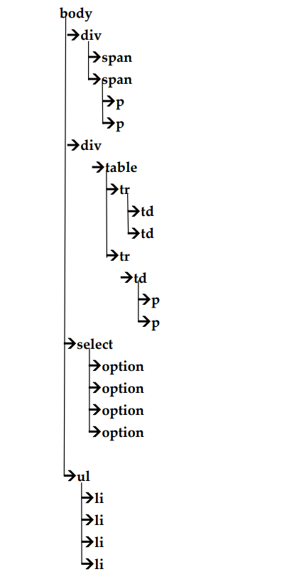


### Scripts

**Scenario**: Write a script to launch the browser, maximize the window, navigate to my web page, locate and click on my link using attribute approach of relative xpath,locate and click on options present in select box by using text () approach of relative xpath, locate and on click options present in select box by using contains() approach of relative xpath.

**HTML Code**

```html
<!DOCTYPE html>
<html>
<head>
 <title>My WebPage </title>
</head>
<body>
<div id="div1">
 <span>
 <p> paragraph1</p>
 </span>
 <span>
 <p> paragraph2</p>
 <p> paragraph3</p>
 </span>
</div>
<div id="div2">
 <table border>
 <tr>
 <td><a href="https://www.amazon.com/" target="_blank">my link</a></td>
 <td></td>
 </tr>
 <tr>
 <td>
 <p>paragraph4</p>
 <p>paragraph5</p>
 </td>
 </tr>
 </table>
</div>
<br>
<select id="subject">
 <option>java </option>
 <option>manual testing</option>
 <option>automation testing</option>
 <option>sql</option>
</select>
<ul id="number">
<ul id="number">
<li value="one">one</li>
<li value="two">two</li>
<li value="three">three</li>
<li value="four">four</li>
<li value="five">five</li>
</ul>
</body>
</html>
```

```java
package Domstructure;

import org.openqa.selenium.By;
import org.openqa.selenium.chrome.ChromeDriver;


public class TestScript1 {

	public static void main(String[] args) {
		// TODO Auto-generated method stub
		// launching the browser
		ChromeDriver driver = new ChromeDriver();
		// maximize the window
		driver.manage().window().maximize();
		// navigating to my web page
		driver.get("E:\\Automation\\Selenium\\HTML\\Index3.html");
		//locate and click on my link using attribute approach of relative xpath
		driver.findElement(By.xpath("//a[@target='_blank']")).click();
		//locate and on click options present in select box by using text () approach of relative xpath
		driver.findElement(By.xpath("//option[text()='automation testing']")).click();
		//locate and on click options present in select box by using contains () approach of relative xpath
		driver.findElement(By.xpath("//option[contains(text(),'m')]")).click();
		//locate and click on list three using starts-with approach of relative xpath
		driver.findElement(By.xpath("//li[starts-with(@value,'th')]")).click();
		//locate and click on my link using AND approach of relative xpath
		driver.findElement(By.xpath("//a[@target='_blank' and @id='anchor']")).click();
		//locate and click on my link using OR approach of relative xpath
		driver.findElement(By.xpath("//a[@target='_blank' or @id='ancho']")).click();
		//locate and click on my link using axes method of relative xpath to locate parent tag approach
		driver.findElement(By.xpath("//a[@target='_blank']//parent::td")).click();
		//locate and click on list three using axes method of relative xpath to locate child tag approach
		driver.findElement(By.xpath("//ul[@id='number']//child::li[3]")).click();
		//locate and click on my link using axes method of relative xpath to locate ancestor tag approach
		driver.findElement(By.xpath("//a[@target='_blank']//ancestor::table")).click();
		//locating the following siblings of 'two' in my web page using axes method of relative xpath to locate following-sibling tag approach 
		driver.findElement(By.xpath("//li[@value='two']//following-sibling::li[2]")).click();
		//locate and click on my link using axes method of relative xpath to locate following tag approach 
		driver.findElement(By.xpath("//div[@id='div2']//following::a")).click();

	}

}

```


#### Scripts 2

**Scenario**: Write a script to launch the browser, maximize the window, navigate to Instagram web page, locate and send keys to phone number box using attributeapproach of relative xpath.

```java

package Domstructure;

import org.openqa.selenium.By;
import org.openqa.selenium.chrome.ChromeDriver;

public class TestScript2 {

	public static void main(String[] args) {
		// TODO Auto-generated method stub

		// launching the browser
		ChromeDriver driver = new ChromeDriver();
		// maximize the window
		driver.manage().window().maximize();
		// navigating to my instagram page
		driver.get("https://www.instagram.com//");
		try {
			Thread.sleep(2000);
		} catch (InterruptedException e) {
			// TODO Auto-generated catch block
			e.printStackTrace();
		}
		//locating the phone number box and sending keys using, attribute approach of 	relative xpath
		driver.findElement(By.xpath("//input[@name='username']")).sendKeys("7845612569");
		

	}

}


```


#### Scripts 3

**Scenario**: Write a script to launch the browser, maximize the window, navigate to facebook web page, locate the create new hyperlink, after clicking, locate and click on any month option using contains ( ) approach of relative xpath.

```java

package Domstructure;

import org.openqa.selenium.By;
import org.openqa.selenium.WebElement;
import org.openqa.selenium.chrome.ChromeDriver;

public class TestScript3 {

	public static void main(String[] args) {
		// TODO Auto-generated method stub
		// launching the browser
		ChromeDriver driver = new ChromeDriver();
		// maximize the window
		driver.manage().window().maximize();
		// navigating to Facebook page
		driver.get("https://www.facebook.com/");
		// locating the Create new account hyperlink
		WebElement link = driver.findElement(By.partialLinkText("Create new account"));
		// clicking the Create new account hyperlink
		link.click();
		try {
			Thread.sleep(3000);
		} catch (InterruptedException e) {
			// TODO Auto-generated catch block
			e.printStackTrace();
		}
		driver.findElement(By.xpath("//option[contains(text(),'Dec')]")).click();
		

	}

}
```


#### Scripts 4

**Scenario**: Write a script to launch the browser, maximize the window, navigate to Instagram web page, locate and send keys to password field using starts-with() approach of relative xpath,


```java
package Domstructure;
import org.openqa.selenium.By;
import org.openqa.selenium.chrome.ChromeDriver;

public class TestScript4 {

	public static void main(String[] args) {
		// TODO Auto-generated method stub
		// launching the browser
		ChromeDriver driver = new ChromeDriver();
		// maximize the window
		driver.manage().window().maximize();
		// navigating to my instagram page
		driver.get("https://www.instagram.com//");
		try {
			Thread.sleep(2000);
		} catch (InterruptedException e) {
			// TODO Auto-generated catch block
			e.printStackTrace();
		}
		//locating the password field and sending keys using starts-with() approach of relative xpath
		driver.findElement(By.xpath("//input[starts-with(@name,'password')]")).sendKeys("783445678");
	}

}
```


#### Scripts 5

**Scenario**: Write a script to launch the browser, maximize the window, navigate to facebook web page, locate the create new hyperlink, after clicking, locate and click on DOB drop down box using axes method of relative xpath to locate child tag approach


```java
package Domstructure;

import org.openqa.selenium.By;
import org.openqa.selenium.WebElement;
import org.openqa.selenium.chrome.ChromeDriver;

public class TestScript5 {

	public static void main(String[] args) {
		// TODO Auto-generated method stub

		// launching the browser
		ChromeDriver driver = new ChromeDriver();
		// maximize the window
		driver.manage().window().maximize();
		// navigating to Facebook page
		driver.get("https://www.facebook.com/");
		// locating the Create new account hyperlink
		WebElement link = driver.findElement(By.partialLinkText("Create new account"));
		// clicking the Create new account hyperlink
		link.click();
		try {
			Thread.sleep(3000);
		} catch (InterruptedException e) {
			// TODO Auto-generated catch block
			e.printStackTrace();
		}
		//locate and click on my link using axes method of relative xpath to locate child tag .
		driver.findElement(By.xpath("//select[@id='day']//child::option[23]")).click();
		driver.findElement(By.xpath("//select[@id='month']//child::option[12]")).click();
		driver.findElement(By.xpath("//select[@id='year']//child::option[97]")).click();

	}

}

```

#### Scripts 6

**Scenario**:Write a script to launch the browser, maximize the window, navigate to facebook web page, locate the create new hyperlink, after clicking, locate and click on following siblings of 'year' using axes method of relative xpath to locate following-sibling tag approach

```java
package Domstructure;
import org.openqa.selenium.By;
import org.openqa.selenium.WebElement;
import org.openqa.selenium.chrome.ChromeDriver;

public class TestScript6 {

	public static void main(String[] args) {
		// TODO Auto-generated method stub
		// launching the browser
		ChromeDriver driver = new ChromeDriver();
		// maximize the window
		driver.manage().window().maximize();
		// navigating to Facebook page
		driver.get("https://www.facebook.com/");
		// locating the Create new account hyperlink
		WebElement link=driver.findElement(By.partialLinkText("Create new account"));
		// clicking the Create new account hyperlink
		link.click();
		try {
			Thread.sleep(3000);
		} catch (InterruptedException e) {
			// TODO Auto-generated catch block
			e.printStackTrace();
		}
		//locating the following siblings of 'year' in facebook page using axes method of relative xpath to locate following-sibling tag approach
		driver.findElement(By.xpath("//select[@id='year']//following-sibling::option[@value='2000']")).click();
		

	}

}

```


#### Scripts 7

**Scenario**: Write a script to launch the browser, maximize the window, navigate to google page, locate the search bar, send the keys as KodNest and print all the suggestions on the console

```java
package Domstructure;
import java.util.List;
import org.openqa.selenium.By;
import org.openqa.selenium.WebElement;
import org.openqa.selenium.chrome.ChromeDriver;

public class TestScript7 {

	public static void main(String[] args) {
		// TODO Auto-generated method stub
		//launching the browser
		ChromeDriver driver = new ChromeDriver();
		//maximize the window
		driver.manage().window().maximize();
		//navigating to google page
		driver.get("https://www.google.com/");
		//locating search bar in google page
		WebElement search = driver.findElement(By.name("q"));
		//sending the keys to search bar
		search.sendKeys("amazon");
		try {
			Thread.sleep(2000);
		} catch (InterruptedException e) {
			// TODO Auto-generated catch block
			e.printStackTrace();
		}
		//locating all the suggestions given by search bar using tagName locator
		List<WebElement> ele = driver.findElements(By.tagName("li"));
		//traversing the web element
		for (WebElement e : ele)
		{
		//printing all the suggestions on console
		System.out.println(e.getText());
		}

		
	}

}

```

Output:

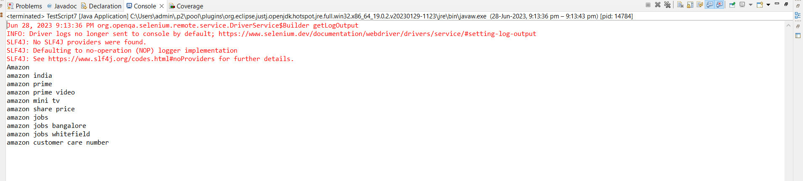

## SYNCHRONIZATION ON WEBDRIVER

* Using Thread.sleep() we can’t maintain a proper synchronization between Selenium WebDriver and Web Page loading time.

* If Thread.sleep() is applied on Selenium WebDriver then this approach will allow Selenium to resume the execution only after completion of the given duration.
* To avoid this situation Selenium has provided waits.

➢ **SELENIUM WAITS**:

➢ There are two types of waits in selenium 

1. Implicit wait.
2. Explicit wait.

➢ IMPLICIT WAIT

* Implicit wait will apply the wait on all the findElement() or findElements() methods.

* Implicit wait is applied by using implicitlyWait() method.

* In implicit wait if selenium is not able to locate the web element the we get ‘NoSuchElementException’.

➢ EXPLICIT WAIT

* Explicit wait applies the wait only on the particular web element.

* Explicit wait is applied by creating the object of WebDriverWait class.

* In explicit wait if the given condition is wrong then we get ‘TimeOutException’, if selenium is not able to locate the web element the we get ‘NoSuchElementException’.


### Scripts 

**Scenario**: Write a script to launch the browser, maximize the window, navigate to Facebook page, locate and click on create new account button, after clicking provide IMPLICIT WAIT, locate and send keys to first name web element.

```java
package Seleniumwait;
import java.io.IOException;
import java.time.Duration;
import org.openqa.selenium.By;
import org.openqa.selenium.WebElement;
import org.openqa.selenium.chrome.ChromeDriver;

public class TestScript1 {

	public static void main(String[] args) {
		// TODO Auto-generated method stub
		// launching the browser
		ChromeDriver driver = new ChromeDriver();
		// maximize the window
		driver.manage().window().maximize();
		// navigating to Facebook page
		driver.get("https://www.facebook.com/");
		// locating the Create new account hyperlink
		WebElement link = driver.findElement(By.partialLinkText("Create new account"));
		// clicking the Create new account hyperlink
		link.click();
		//implicit wait
		driver.manage().timeouts().implicitlyWait(Duration.ofSeconds(10));
		// locating the first name web element
		WebElement firstname = driver.findElement(By.name("firstname"));
		// sending values to first name web element
		firstname.sendKeys("lokesh");
		

	}

}

```


#### Scripts 2

**Scenario**: Write a script to launch the browser, maximize the window, navigate to Facebook page, locate and click on create new account button, after clicking provide EXPLICIT WAIT, locate and send keys to first name web element

```java
package Seleniumwait;
import java.io.IOException;
import java.time.Duration;
import org.openqa.selenium.By;
import org.openqa.selenium.WebElement;
import org.openqa.selenium.chrome.ChromeDriver;
import org.openqa.selenium.support.ui.ExpectedConditions;
import org.openqa.selenium.support.ui.WebDriverWait;

public class TestScript2 {

	public static void main(String[] args) {
		// TODO Auto-generated method stub
		
		// launching the browser
		ChromeDriver driver = new ChromeDriver();
		// maximize the window
		driver.manage().window().maximize();
		// navigating to Facebook page
		driver.get("https://www.facebook.com/");
		// locating the Create new account hyperlink
		WebElement link = driver.findElement(By.partialLinkText("Create new account"));
		// clicking the Create new account hyperlink
		link.click();
		//explicit wait
		WebDriverWait wait=new WebDriverWait(driver, Duration.ofSeconds(10));
		wait.until(ExpectedConditions.visibilityOfElementLocated(By.name("firstname")));
		// locating the first name web element
		WebElement firstname = driver.findElement(By.name("firstname"));
		// sending values to first name web element
		firstname.sendKeys("lokesh");

	}

}

```
## FRAMEWORKS IN SELENIUM

1. Junit.

2. TestNG.

* We can add any frame work into our project by following two approaches

1. Adding as a jar file.

2. Adding as a dependency injection.


### STEPS TO ADD JUNIT TO JAVA PROJECT AS A JAR FILE 

STEP-1: Right click on the java project.

STEP-2: Click on build path.

STEP-3: Select configure build path.

STEP-4: Click on libraries.

STEP-5: Click on class path.

STEP-6: Then click on add libraries.

STEP-7: Select Junit.

STEP-8: Apply and Close.

### STEPS TO CREATE MAVEN PROJECT AND ADD DEPENDENCY INJECTION

STEP-1: Click on file and create Maven project by providing data for Group Id and Artifact Id and Maven project should be a simple project.

STEP-2: Click on POM.xml file and create "dependencies" tag inside the project and add or inject the dependency inside "dependencies" tag

STEP-3: To get the respective POM.xml code, we need to visit Maven Repository.

#### ADDING JUNIT AND SELENIUM DEPENDENCY TO MAVEN PROJECT

```xml

<project xmlns="http://maven.apache.org/POM/4.0.0"
	xmlns:xsi="http://www.w3.org/2001/XMLSchema-instance"
	xsi:schemaLocation="http://maven.apache.org/POM/4.0.0 https://maven.apache.org/xsd/maven-4.0.0.xsd">
	<modelVersion>4.0.0</modelVersion>
	<groupId>Selenium</groupId>
	<artifactId>Selenium-Automation</artifactId>
	<version>0.0.1-SNAPSHOT</version>

	<dependencies>
		<!-- https://mvnrepository.com/artifact/junit/junit -->
		<dependency>
			<groupId>junit</groupId>
			<artifactId>junit</artifactId>
			<version>4.13.2</version>
			<scope>test</scope>
		</dependency>
		<!--
		https://mvnrepository.com/artifact/org.seleniumhq.selenium/selenium-java -->
		<dependency>
			<groupId>org.seleniumhq.selenium</groupId>
			<artifactId>selenium-java</artifactId>
			<version>4.8.3</version>
		</dependency>
	</dependencies>

</project>

```
### BASIC JUNIT PROGRAM in JAVA PROJECT AND MAVEN PROJECT

**JAVA PROJECT**

**CODE**:

```java
package junit;
import org.junit.jupiter.api.Test;

public class FirstJunit {

	@Test
	public void add()
	{
	System.out.println("Addition is "+(10+20));
	}
	@Test
	public void sub()
	{
	System.out.println("Subtraction is "+(10-20));
	}
	}

```

**OUTPUT**
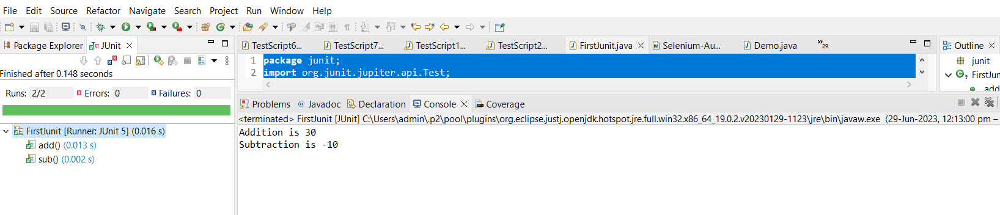

**MAVEN PROJECT**

**CODE**:

```java
import org.junit.Test;
	
public class Demo {

	
	@Test
	public void add()
	{
	System.out.println("Addition is "+(10+20));
	}
	@Test
	public void mul()
	{
	System.out.println("Multiplication is "+(10*20));
	}
	
}
```

**OUTPUT**
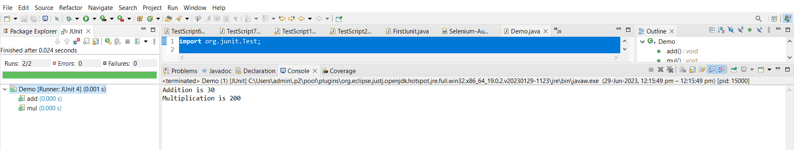

### STEPS TO ADD TestNG TO JAVA PROJECT AS A JAR FILE 

* STEP-1: Right click on the java project.

* STEP-2: Click on build path.

* STEP-3: Select configure build path.

* STEP-4: Click on libraries.

* STEP-5: Check if TestNG library is present.

* STEP-6: If TestNG library is not present then install it from eclipse market place.

* STEP-7: After installing restart the eclipse IDE.

* STEP-8: Right click on the java project.

* STEP-9: Click on build path.

* STEP-10: Select configure build path.

* STEP-11: Click on libraries.

* STEP-12: Click on class path.

* STEP-13: Then click on add libraries.

* STEP-14: Select TestNG.

* STEP-15: Apply and Close.

#### TestNG PROGRAM in JAVA PROJECT

**CODE**:

```java
package TestNG;
import org.testng.annotations.Test;

public class testng {

	@Test
	public void add()
	{
	System.out.println("Addition is "+(10+20));
	}
	@Test
	public void sub()
	{
	System.out.println("Subtraction is "+(10-20));
	}
	@Test
	public void mul()
	{
	System.out.println("Multiplication is "+(10*20));
	}
	@Test
	public void div()
	{
	System.out.println("Division is "+(20/10));
	}
	}
```

**OUTPUT**

```
Addition is 30
Division is 2
Multiplication is 200
Subtraction is -10
PASSED: TestNG.testng.sub
PASSED: TestNG.testng.mul
PASSED: TestNG.testng.add
PASSED: TestNG.testng.div

===============================================
    Default test
    Tests run: 4, Failures: 0, Skips: 0
===============================================


===============================================
Default suite
Total tests run: 4, Passes: 4, Failures: 0, Skips: 0
===============================================
```
**TEST REPORT**

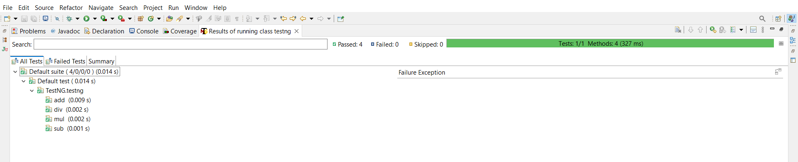

#### Program to give priority using ‘priority’ keyword.

**CODE** :

```java
package TESTNG;
import org.testng.annotations.Test;

public class priority {


	@Test(priority = 1)
	public void add()
	{
	System.out.println("Addition is "+(10+20));
	}
	@Test(priority = 2)
	public void sub()
	{
	System.out.println("Subtraction is "+(10-20));
	}
	@Test(priority = 3)
	public void mul()
	{
	System.out.println("Multiplication is "+(10*20));
	}
	@Test(priority = 4)
	public void div()
	{
	System.out.println("Division is "+(20/10));
	}
	}
	
```

**OUTPUT**

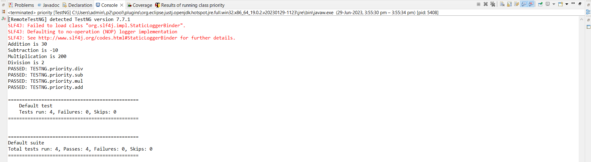

#### Program to give ‘priority’ and ‘description’ to the given methods

* The description content will be present only on the console not in the email able report.

* The priority key is used to set the priority on the given methods.

**CODE**:

```java

package TESTNG;

import org.testng.annotations.Test;

public class PriorityDescription {

	@Test(priority = 1)
	public void add()
	{
	System.out.println("Addition is "+(10+20));
	}
	@Test(priority = 2)
	public void sub()
	{
	System.out.println("Subtraction is "+(10-20));
	}
	@Test(priority = 3,description = "The mul method should be passed kindly check ")
	public void mul()
	{
	System.out.println("Multiplication is "+(10*20));
	}
	@Test(priority = 4)
	public void div()
	{
	System.out.println("Division is "+(20/10));
	}
	

}

```

**OUTPUT**:

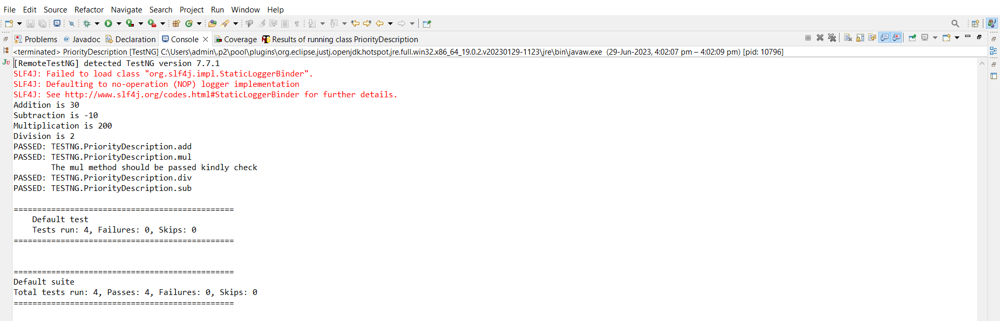

#### ANNOTATIONS AND PROPERTIES IN TestNG

1. **BeforeMethod_Annotations**: If this annotation is annotated to any method, then that method will execute before each and every @Test annotated method.

2. **AfterMethod_Annotations**: If this annotation is annotated to any method, then that method will execute after each and every @Test annotated method.

3. **BeforeTest_Annotation**: If this annotation is annotated to any method, then that method will execute before all the @Test annotated method.

4. **AfterTest_Annotation**: If this annotation is annotated to any method, then that method will execute after all the @Test annotated method.

5. **Priority Property**: Priority property is used to set the priority for a particular test during test execution.

6. **Description Property**: Description property is used to display a message in the console after test execution.


#### SCripts

**Program to demonstrate the usage of BeforeMethod annotation and AfterMethod annotation.**

**CODE** :

```java
package TESTNG;
import org.testng.annotations.AfterMethod;
import org.testng.annotations.BeforeMethod;
import org.testng.annotations.Test;


public class Afterandbefore {

	@BeforeMethod
	public void login_Test()
	{
	System.out.println("Login Completed");
	}
	@Test
	public void compose_Test()
	{
	System.out.println("composing of mail Completed");
	}
	@Test
	public void sendmail_Test()
	{
	System.out.println("sending of mail is Completed");
	}
	@AfterMethod
	public void logout_Test()
	{
	System.out.println("logout is Completed");
	}

	
}

```

**OUTPUT**:

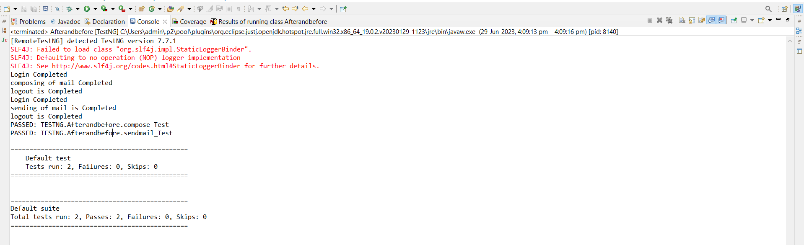

#### SCripts 2

**Program to demonstrate the usage of SkipException in maven project**

* SkipException Class in TestNG: SkipException is an Exception class provided by TestNG framework to skip the test execution.

* Every test skip will be reflected in the test report.

**CODE**:

```java
package TESTNG;
import org.testng.SkipException;
import org.testng.annotations.Test;

public class Skip {

	@Test
	public void add() {
	int a=12;
	int b=45;
	int c=a+b;
	System.out.println(c);
	throw new SkipException("Still under development");
	}
	@Test
	public void sub() {
	int a=12;
	int b=45;
	int c=a-b;
	System.out.println(c);
	}
	}
```

**OUTPUT**

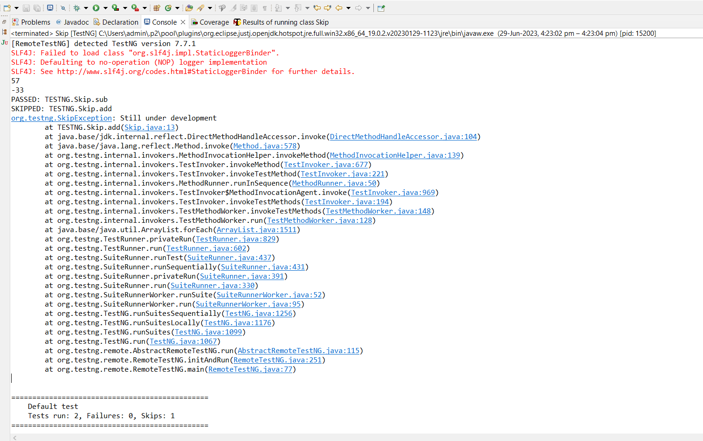


#### SCripts 3

**Write a program in TestNG Maven Project to launch the chrome browser, maximize the window, navigate to google page, get the title and compare the actual title and expected title using assertions with a positive test case scenario.**

**CODE**

```java
package TESTNG;
import org.openqa.selenium.WebDriver;
import org.openqa.selenium.chrome.ChromeDriver;
import org.testng.Assert;
import org.testng.annotations.Test;

public class Chrome {
	@Test
	public void compare() 
	{
	//launching the browser
	WebDriver driver = new ChromeDriver();
	//maximize the window 
	driver.manage().window().maximize();
	//storing the expected title
	String expected_title="Google";
	//navigating to google page 
	driver.navigate().to("https://www.google.com");
	//getting the actual title
	String actual_title=driver.getTitle();
	//comparing expected title and actual title
	Assert.assertEquals(actual_title, expected_title);
	}
	}

```

**OUTPUT**

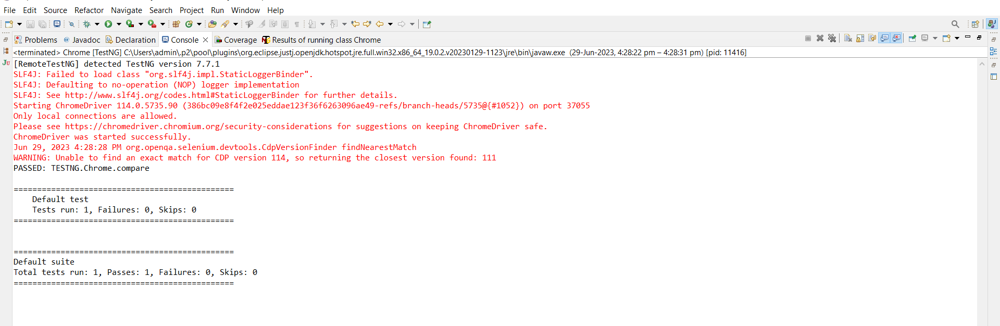

#### SCripts 4

**Write a program in TestNG Maven Project to launch the chrome browser, maximize the window, navigate to YATRA page, locate and click on 1 Travellers(s), class print the text on the console, after performing click action 5 times on adult section the text will change to 5 Travellers(s), class print the text on the console, now compare the actual URL and current URL of yatra page using assertions and close the browser**

**CODE**

```java
package TESTNG;
import java.time.Duration;
import org.openqa.selenium.By;
import org.openqa.selenium.WebDriver;
import org.openqa.selenium.WebElement;
import org.openqa.selenium.chrome.ChromeDriver;
import org.testng.Assert;
import org.testng.annotations.Test;


public class yatri {
	@Test
	public void demo()
	{
	//launch the browser
	WebDriver driver = new ChromeDriver();
	//maximize the window
	driver.manage().window().maximize();
	//navigate to yatra page
	driver.get("https://www.yatra.com/");
	//locating and clicking on 1 Travellers(s) ,class
	WebElement a = driver.findElement(By.className("txt-ellipses"));
	//printing the text on the console
	System.out.println(a.getText());
	a.click();
	// Set implicit wait to 10 seconds
	driver.manage().timeouts().implicitlyWait(Duration.ofSeconds(10));
	//clicking 5 times on the adult section
	for (int i = 0; i < 4; i++)
	{
	//locating and performing click action on the adult section
	driver.findElement(By.className("ddSpinnerPlus")).click();
	}
	//locating and clicking on 5 Travellers(s) ,class
	WebElement c = driver.findElement(By.className("txt-ellipses"));
	//printing the text on the console
	System.out.println(c.getText());
	//storing the actual url
	String actualURL="https://www.yatra.com/";
	//storing the current url
	String currentURL= driver.getCurrentUrl();
	//printing the actual url
	System.out.println(actualURL);
	//printing the current url
	System.out.println(currentURL);
	// Compare actualURL and currentURL using assertions
	Assert.assertEquals(actualURL, currentURL);
	//close the browser
	driver.close();
	}
	}


```

**OUTPUT**

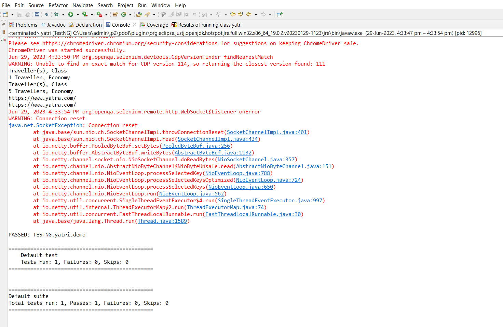

#### PROJECT ON E-COMMERCE WEBSITE(AMAZON)

**Performing end to end testing till payment gateway on amazon application using selenium web driver for performing automation testing and TestNG for generating report.** 

**CODE**

```java

package TESTNG;
import java.time.Duration;
import java.util.Set;
import org.openqa.selenium.By;
import org.openqa.selenium.Keys;
import org.openqa.selenium.WebDriver;
import org.openqa.selenium.chrome.ChromeDriver;
import org.testng.annotations.Test;

public class amazon {

	@Test
	public void demo()
	{
	//launching the browser
	WebDriver driver = new ChromeDriver();
	//maximizing the window
	driver.manage().window().maximize();
	//navigating to amazon page
	driver.get("https://www.amazon.in/");
	//locating search bar and sending keys and clicking enter
	driver.findElement(By.id("twotabsearchtextbox")).sendKeys("City of Djins: year in Delhi", Keys.ENTER);
	//locating and clicking on the book
	
	driver.findElement(By.cssSelector("img[src='https://m.media-amazon.com/images/I/51u8SeCRi1L._AC_UY218_.jpg']")).click();
	
	//driver.findElement(By.cssSelector("#search > div.s-desktop-width-max.s-desktop-content.s-wide-grid-style-t3.s-opposite-dir.s-wide-grid-style.sg-row > div.sg-col-20-of-24.s-matching-dir.sg-col-16-of-20.sg-col.sg-col-8-of-12.sg-col-12-of-16 > div > span.rush-component.s-latency-cf-section > div.s-main-slot.s-result-list.s-search-results.sg-row > div:nth-child(7) > div > div > div > div > div > div.sg-col.sg-col-4-of-12.sg-col-4-of-16.sg-col-4-of-20.sg-col-4-of-24.s-list-col-left > div > div.s-product-image-container.aok-relative.s-text-center.s-image-overlay-grey.puis-image-overlay-grey.s-padding-left-small.s-padding-right-small.s-flex-expand-height.puis.puis-v132n5e4faosf42v0eo3rf7vw9m > div > span > a > div > img")).click();
	//getting the address of parent window
	
	
	String parent = driver.getWindowHandle();
	//applying implicit wait
	driver.manage().timeouts().implicitlyWait(Duration.ofSeconds(10));
	// Getting the address of parent and child window
	Set<String> address = driver.getWindowHandles();
	// Switching to the child window
	for (String e : address)
	{
	if(!e.equalsIgnoreCase(parent))
	{
	driver.switchTo().window(e);
	}
	}
	//locating and clicking on buy now button
	driver.findElement(By.name("submit.buy-now")).click();
	//locating and sending keys to password
	driver.findElement(By.name("email")).sendKeys("8970145866",Keys.ENTER);
	//locating password and sending keys
	driver.findElement(By.id("ap_password")).sendKeys("Autom@tion",Keys.ENTER);
	
	}

}
```

**OUTPUT**

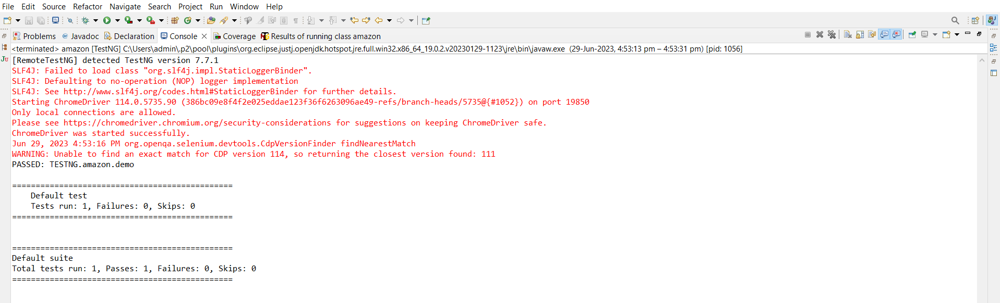

